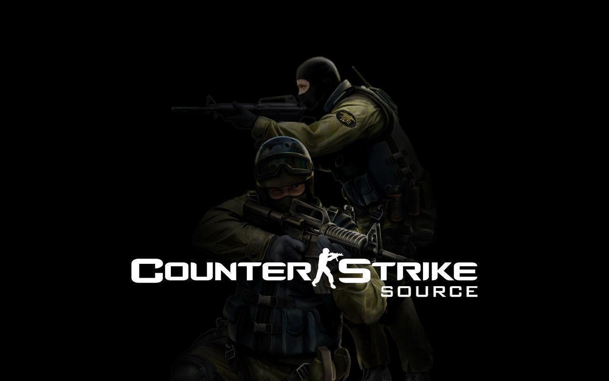

<p align="center">
  
</p>

# Plugins de Counter-Strike: Source

Quinze plugins SourceMod escritos para servidores de CS:S, em produção desde 2026.

Cada um existe porque alguma coisa no jogo **estava quebrada, faltando, ou nunca
funcionou como o manual diz**. Por isso cada entrada abaixo traz, junto do que o
plugin faz, o **achado de engine** que obrigou ele a existir — que é a parte que
não está documentada em lugar nenhum e a que provavelmente te trouxe aqui.

Escritos em português. Código, comentários e mensagens de jogo.

---

## Índice

| Plugin | O que faz |
|---|---|
| [`lendas_spec`](#lendas_spec) | Impede zerar dominância e farmar dinheiro pelo espectador |
| [`lendas_firenade`](#lendas_firenade) | Molotov, com a fumaça apagando o fogo como no CS2 |
| [`lendas_clantag`](#lendas_clantag) | Devolve a tag de grupo Steam que o jogo parou de exibir |
| [`lendas_viewmodel`](#lendas_viewmodel) | Posição da arma na tela, por jogador |
| [`lendas_noscope`](#lendas_noscope) | Anuncia abates de AWP e Scout sem mira |
| [`lendas_headshotfx`](#lendas_headshotfx) | Sangue direcional no ponto atingido |
| [`lendas_tickinfo`](#lendas_tickinfo) | Diagnóstico: linha de comando do srcds e tickrate real |
| [`lendas_demos`](#lendas_demos) | Grava demos do SourceTV com nome estruturado |
| [`lendas_matches`](#lendas_matches) | Persiste placar, rounds e scoreboard |
| [`lendas_live`](#lendas_live) | Manda o estado da partida ao vivo pra um backend HTTP |
| [`lendas_steamfilter`](#lendas_steamfilter) | Portaria: horas, idade da conta, VAC, perfil privado |
| [`lendas_playerstats`](#lendas_playerstats) | Abates por arma, headshots e bombas |
| [`lendas_players`](#lendas_players) | Índice de nick para SteamID64 |
| [`lendas_bans`](#lendas_bans) | Exporta banimentos do SourceBans++ para JSON |
| [`lendas_fov`](#lendas_fov) | **Encerrado.** Documenta por que FOV é impossível no CS:S |

---

## Compilar

Precisa do compilador do SourceMod (`spcomp` / `spcomp64`) e dos includes dele.

```powershell
.\build.ps1 -Compiler "C:\caminho\para\scripting\spcomp64.exe"
```

Os `.smx` saem em `build/`. O script compila todos antes de reclamar e lista as
falhas no fim — parar no primeiro erro esconderia que os outros estão bem.

Para compilar um só:

```
spcomp64 scripting/lendas_spec.sp -o build/lendas_spec.smx
```

### A única dependência externa

Três plugins — `lendas_clantag`, `lendas_live` e `lendas_steamfilter` — usam
[**SteamWorks**](https://github.com/KyleSanderson/SteamWorks), que **não vem com o
SourceMod**. Sem o include deles, esses três falham com
`error 417: cannot read from file: "SteamWorks"` e os outros doze compilam normal.

Baixe o SteamWorks e aponte a pasta de include:

```powershell
.\build.ps1 -Compiler "...\spcomp64.exe" -Include "C:\steamworks\include"
```

O resto usa só o que já vem na instalação do SourceMod.

## Instalar

Copie o `.smx` para `addons/sourcemod/plugins/`. Todos usam `AutoExecConfig`, então
o `.cfg` nasce sozinho em `cfg/sourcemod/` no primeiro carregamento — **e é ele que
vale**, não o `server.cfg`: os cfg do SourceMod rodam depois e sobrescrevem.

---

## Os plugins

### `lendas_spec`

Impede zerar dominância e ganhar dinheiro indo ao espectador e voltando.

**O buraco.** O jogador dominado ia pro espectador e voltava limpo: a dominância
sumia e ele ainda recebia o dinheiro inicial de novo.

**O achado.** Trocar de time limpa as relações de `m_bPlayerDominated`, e reentrar
num time paga `mp_startmoney` — nas rodadas de faca isso vale $10.000, não $800.

A foto do estado tem que ser tirada no listener de `jointeam`, **antes** da troca.
No evento `player_team` já é tarde: o jogo zerou tudo antes de avisar. E a
devolução espera o quadro seguinte, senão o jogo sobrescreve.

O espelho da dominância no **outro** jogador também precisa ser reposto, senão um
lado vê a relação e o outro não.

Quem repete leva anúncio no chat, som e multa. Dois freios evitam acusar inocente:
quem fica mais que `lendas_spec_janela` segundos no espectador não é cobrado, e
`lendas_spec_tolerancia` perdoa as primeiras.

### `lendas_firenade`

Granada incendiária, com a fumaça apagando o fogo como no CS2.

**O achado.** A entrada `Extinguish` do `env_fire` **não aceita parâmetro** neste
engine — o wiki da Valve diz o contrário, e passar um valor derruba o link de
entrada/saída com `doesn't match type from env_fire()`.

`m_FadeStartTime` e `m_FadeEndTime` do `env_particlesmokegrenade` são segundos
**desde o spawn**, não instantes absolutos. É o que permite dissipar a fumaça em
vez de matar a entidade, que some de uma vez e fica feio.

`StopSound` tem que vir **antes** do `Kill`, ou o som do fogo continua tocando
depois da chama apagar.

### `lendas_clantag`

Devolve a tag do grupo Steam do jogador, que o jogo parou de exibir.

**O buraco.** Depois de uma atualização, nenhum jogador conseguia usar a própria
tag de grupo. É bug do jogo — [issue aberta desde 2019](https://github.com/ValveSoftware/Source-1-Games/issues/2853),
sem correção.

**O achado.** O cliente **continua enviando** `cl_clanid`. Só a exibição quebrou.
Daí dá pra refazer o trabalho por fora:

```
gid64 = 103582791429521408 + cl_clanid
GET /gid/<gid64>/memberslistxml/?xml=1   → <groupURL>
GET /groups/<vanity>                     → grouppage_header_abbrev
CS_SetClientClanTag
```

São **duas** requisições porque nenhuma redireciona, e porque o XML do grupo não
traz a abreviação — ela só existe no HTML da página, lá pelo byte 34.000 de 74 KB,
o que inviabiliza `Range`.

A soma de 64 bits é feita dígito a dígito: SourcePawn não tem inteiro de 64 bits.

Só escreve quando a tag atual está **vazia**, pra conviver com plugins de mix que
põem tag de time.

### `lendas_viewmodel`

Deixa cada jogador escolher o quão perto a arma aparece na tela.

**O buraco.** O CS:S não tem `viewmodel_offset_x/y/z` (são do CS:GO) e o
`viewmodel_fov` é resto morto do Half-Life 2 — o comando existe e não faz nada.

**O achado.** O cliente trata os dois lados do FOV padrão de forma **assimétrica**:

- **acima de 90** ele recusa alargar a visão, e só a câmera do viewmodel se desloca,
  por `fovViewmodel = viewmodel_fov - (m_iDefaultFOV - 90)`. Arma mais perto, mundo
  intacto;
- **abaixo de 90** ele aceita, porque estreitar é zoom — e o estado de zoom apaga a
  arma da tela.

Por isso dá pra aproximar a arma e é impossível afastar. O 90 não é escolha nossa,
é fronteira do engine. Quem quiser a arma mais longe precisa de pacote de modelos
com a geometria reposicionada, do lado do cliente.

### `lendas_noscope`

Anuncia eliminações de AWP e Scout sem mira, com a distância aproximada.

**O achado.** `m_bIsScoped` **não existe** no CS:S — é netprop de CS:GO. A detecção
cai no `m_iFOV`, e comparar com **90 fixo é armadilha**: qualquer plugin de FOV põe
o jogador permanentemente dentro da faixa lida como "com mira", e nenhum abate dele
volta a contar.

A comparação certa é contra o `m_iDefaultFOV` do próprio jogador. Sem plugin de FOV
os dois valores são iguais e o comportamento não muda; com um, só o zoom real da
arma desce abaixo do padrão.

### `lendas_headshotfx`

Sangue no ponto atingido, com direção e volume conforme o tiro.

**O achado.** O jato tem que sair na direção da bala — do olho do atirador até o
ponto de impacto **guardado**, nunca até a posição da vítima lida na hora: no
`player_death` ela já morreu e a posição não vale mais nada.

A altura do respingo vem do hitgroup, com correção pra quem está agachado. Sangue
sempre na mesma altura lê como cenário, não como tiro.

### `lendas_tickinfo`

Diagnóstico. Lê de dentro do processo a linha de comando do `srcds` e o intervalo
por tick em vigor.

**O buraco.** O painel do host mostrava `-tickrate 100` e o servidor rodava a 66.67.
Nenhum arquivo no disco contava a verdade.

**O achado.** Dá pra medir o tickrate **sem entrar no servidor**: o cabeçalho do
`.dem` tem 1072 bytes fixos, com `playback_time` (float) no offset 1056 e
`playback_ticks` (int32) no 1060. A divisão dá o tickrate. Demo em gravação tem
cabeçalho zerado — usar uma fechada.

A causa era arquitetura: o addon de tickrate instalado era o build **x86-64** e o
servidor roda `srcds_linux` de **32 bits**. O `dlopen` falha em silêncio e o
parâmetro não é lido por ninguém. Os assets da release têm nome enganoso —
`linux-x86` é o de 32 bits.

### `lendas_demos`

Grava a demo do SourceTV por mapa, em `demos/AAAA-MM/AAAAMMDD-HHMM-mapa.dem`.

**O achado.** `tv_autorecord` não serve quando alguém precisa ler os arquivos
depois: ele gera nomes `auto-…`. Carimbar o nome na mão é o que deixa a gravação
casável com o placar.

O nome é escrito depois de esperar o bot do SourceTV entrar, e esses segundos cruzam
a virada do minuto de vez em quando. Quem for casar demo com partida precisa de
**tolerância**, não de igualdade exata.

### `lendas_matches`

Persiste placar, rounds e scoreboard de cada partida encerrada.

**O achado.** `File.ReadLine` trunca em **2048 bytes**, não importa o tamanho do
buffer que você passar. Um JSON de partida inteira numa linha só passa disso e volta
cortado — corrompendo o arquivo na próxima escrita.

A saída é JSON Lines, uma partida por linha, sempre em append. Nunca reler e
reescrever o arquivo todo.

### `lendas_live`

Manda placar, round e jogadores ao vivo pra um backend HTTP.

**O achado.** Uma fila de reenvio que trata todo erro igual se envenena: um lote
recusado com `400` volta pra fila, é recusado de novo, e enche o log de megabytes de
"fila cheia" até o mapa trocar.

Erro `4xx` significa que reenviar não vai adiantar — descarta. As exceções são
`401`, `403` e `429`, que podem melhorar sozinhas.

### `lendas_steamfilter`

Portaria via Steam Web API: horas de jogo, idade da conta, VAC, perfil privado,
jogo compartilhado.

**O achado.** A whitelist tem que ser conferida **antes** das chamadas à Steam. Quem
está liberado não deveria depender de a API estar no ar pra conseguir entrar.

Linha malformada no arquivo de whitelist vai pro log, nunca é engolida em silêncio —
um filtro de portaria que falha calado é pior que um que não existe.

### `lendas_playerstats`

Conta abates por arma, headshots e bombas por jogador.

**O achado.** Gravar a cada evento acaba com o disco num servidor cheio. A escrita é
periódica e no fim do mapa, com o intervalo numa cvar.

### `lendas_players`

Índice de nick para SteamID64.

**O achado.** Log de servidor e ranking web guardam nick, não SteamID. Sem uma ponte
escrita de dentro do jogo não existe jeito confiável de descobrir de quem é aquele
nome — e aí ou se inventa o dado, ou não se mostra nada.

### `lendas_bans`

Exporta banimentos e mutes do SourceBans++ para um JSON.

**O achado.** Quando o MySQL do SourceBans está fechado pra conexões de fora, o
servidor de jogo continua sendo um cliente autorizado dele. Exportar de dentro do
plugin contorna o bloqueio sem abrir porta nenhuma.

### `lendas_fov`

**Encerrado.** Fica aqui só pra registrar por que não dá.

Tentava deixar o jogador escolher o campo de visão. Não é possível por plugin de
servidor no CS:S, e isso custou seis versões até ficar provado.

**O achado.** Escrever `m_iFOV` abre o mundo **e apaga a arma**. Medido com a arma
sumida: `m_hZoomOwner` em −1 e `EF_NODRAW` **desligado** no viewmodel — ou seja, o
servidor não escondia nada. Limpar a marca 66 vezes por segundo não mudou nada, e
escrever a origem do viewmodel também não (`m_vecOrigin` nem existe como propriedade
de rede num `predicted_viewmodel`).

**Quem não desenha a arma é o cliente.** Nenhum plugin de servidor alcança isso — e é
exatamente por isso que só programa externo faz FOV no CS:S, e por isso que dá ban.

Se você chegou aqui procurando um plugin de FOV para CS:S: não existe, e agora você
sabe por quê sem gastar a semana que eu gastei.

---

## Como isso foi investigado

Boa parte do que está acima não veio de documentação — veio de abrir o binário.

Um `.smx` guarda suas strings comprimidas em zlib, na seção apontada por
`readUInt32LE(0x14)`. Descomprimir e ler revela quais netprops, cvars e sons um
plugin toca, **mesmo sem o código-fonte**. Foi assim que apareceu o segundo slot de
viewmodel que explicava uma skin sumida, e assim que se provou qual versão estava
realmente no ar quando o número da versão mentia.

A outra metade veio de medir em vez de supor:

- netprop que talvez não exista se pergunta com `HasEntProp` **antes** de ler — foi o
  `m_bIsScoped` que ensinou isso;
- conclusão tirada de experimento que estourou exceção não vale, e a exceção estava
  no `errors_*.log` o tempo todo;
- defeito em arquivo de tradução **desliga o plugin inteiro**, não só o texto: o
  `LoadTranslations` roda no `OnPluginStart`, e um erro fatal ali aborta o resto da
  função. Uma aspa faltando deixou um plugin de sons mudo por semanas.

## Por que o fonte mora aqui

Um servidor teve o conteúdo copiado por cima e perdeu a versão do plugin de demos
que de fato **gravava** — sobrou uma antiga que só organizava a pasta. O `.sp` dessa
versão não existia em lugar nenhum: nem no servidor, nem em backup, nem em máquina
nenhuma. Só restou reescrever do zero.

Binário compilado não é fonte. Enquanto o `.sp` só existir numa pasta solta, uma
cópia errada apaga o trabalho de vez.

---

<sub>Arte de capa: material promocional de Counter-Strike: Source, da Valve.</sub>
