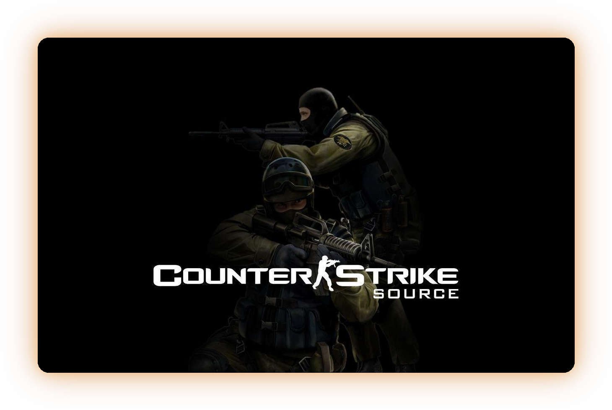

<p align="center">
  
</p>

<p align="center"><b>English</b> · <a href="README.pt-BR.md">Português</a></p>

# Counter-Strike: Source plugins

Fifteen SourceMod plugins running in production on CS:S servers since 2026.

Every one of them exists because something in the game **was broken, missing, or
never worked the way the documentation says**. So each entry below carries, next to
what the plugin does, the **engine finding** that forced it into existence — which is
the part that isn't written down anywhere else, and probably what brought you here.

The code, its comments and the in-game messages are in **Portuguese**. The `lendas_`
prefix is just a namespace to avoid colliding with third-party plugins; nothing here
depends on a particular server.

---

## Index

| Plugin | What it does |
|---|---|
| [`lendas_spec`](#lendas_spec) | Stops players wiping dominations and farming money via spectator |
| [`lendas_firenade`](#lendas_firenade) | Molotov, with smoke extinguishing the fire like in CS2 |
| [`lendas_clantag`](#lendas_clantag) | Restores the Steam group tag the game stopped displaying |
| [`lendas_viewmodel`](#lendas_viewmodel) | Per-player weapon position on screen |
| [`lendas_noscope`](#lendas_noscope) | Announces AWP and Scout no-scope kills |
| [`lendas_headshotfx`](#lendas_headshotfx) | Directional blood at the point of impact |
| [`lendas_tickinfo`](#lendas_tickinfo) | Diagnostic: srcds command line and the real tickrate |
| [`lendas_demos`](#lendas_demos) | Records SourceTV demos with structured filenames |
| [`lendas_matches`](#lendas_matches) | Persists score, rounds and scoreboard |
| [`lendas_live`](#lendas_live) | Pushes live match state to an HTTP backend |
| [`lendas_steamfilter`](#lendas_steamfilter) | Join gate: playtime, account age, VAC, private profile |
| [`lendas_playerstats`](#lendas_playerstats) | Kills per weapon, headshots and bomb plants |
| [`lendas_players`](#lendas_players) | Nickname to SteamID64 index |
| [`lendas_bans`](#lendas_bans) | Exports SourceBans++ bans to JSON |
| [`lendas_fov`](#lendas_fov) | **Retired.** Documents why FOV is impossible on CS:S |

### Not every plugin is useful on its own

Nine run on any CS:S server with nothing else: `spec`, `firenade`, `clantag`,
`viewmodel`, `noscope`, `headshotfx`, `tickinfo`, `steamfilter` and `demos`.

The rest need something on the other end:

- **`live`** POSTs to an HTTP endpoint you have to provide. With no backend it just
  fills its queue and gives up;
- **`bans`** requires SourceBans++ installed — it reads its database;
- **`matches`, `players` and `playerstats`** write JSON to the server's disk. They run
  fine alone, but the file is only worth anything if something of yours reads it.

The engine finding behind each one still holds even if you never run the plugin.

---

## Building

You need the SourceMod compiler (`spcomp` / `spcomp64`) and its includes.

```powershell
.\build.ps1 -Compiler "C:\path\to\scripting\spcomp64.exe"
```

The `.smx` files land in `build/`. The script compiles everything before complaining
and lists the failures at the end — stopping at the first error would hide that the
other fourteen are fine.

To build a single one:

```
spcomp64 scripting/lendas_spec.sp -o build/lendas_spec.smx
```

### The one external dependency

Three plugins — `lendas_clantag`, `lendas_live` and `lendas_steamfilter` — use
[**SteamWorks**](https://github.com/KyleSanderson/SteamWorks), which **does not ship
with SourceMod**. Without its include, those three fail with
`error 417: cannot read from file: "SteamWorks"` and the other twelve build normally.

Grab SteamWorks and point the script at its include folder:

```powershell
.\build.ps1 -Compiler "...\spcomp64.exe" -Include "C:\steamworks\include"
```

Everything else only uses what already comes with SourceMod.

## Installing

Copy the `.smx` into `addons/sourcemod/plugins/`. All of them use `AutoExecConfig`, so
the `.cfg` is generated on first load in `cfg/sourcemod/` — **and that is the file that
wins**, not `server.cfg`: SourceMod's configs run afterwards and overwrite it.

---

## The plugins

### `lendas_spec`

Stops players from wiping dominations and gaining money by going to spectator and
coming back.

**The gap.** A dominated player would go spectator and return clean: the domination
was gone and he collected the starting money again.

**The finding.** Changing teams clears the `m_bPlayerDominated` relationships, and
rejoining a team pays out `mp_startmoney` — on knife rounds that is $10,000, not $800.

The state has to be captured in a `jointeam` command listener, **before** the switch.
By the time the `player_team` event fires it is too late: the game already wiped
everything before announcing it. And restoring has to wait one frame, or the game
overwrites it.

The mirror of the domination on the **other** player has to be restored too, otherwise
one side sees the relationship and the other doesn't.

Repeat offenders get called out in chat, with a sound and a fine. Two brakes keep
innocent players out of it: anyone who stays in spectator longer than
`lendas_spec_janela` seconds is never charged, and `lendas_spec_tolerancia` forgives
the first few.

### `lendas_firenade`

Incendiary grenade, with smoke putting the fire out the way CS2 does it.

**The finding.** The `env_fire` `Extinguish` input **takes no parameter** on this
engine — the Valve wiki says otherwise, and passing a value breaks the I/O link with
`doesn't match type from env_fire()`.

`m_FadeStartTime` and `m_FadeEndTime` on `env_particlesmokegrenade` are seconds
**since spawn**, not absolute timestamps. That is what lets the smoke dissipate
instead of killing the entity, which pops out of existence and looks wrong.

`StopSound` has to come **before** `Kill`, or the fire keeps crackling after the flame
is gone.

### `lendas_clantag`

Restores the player's Steam group tag, which the game stopped displaying.

**The gap.** After a game update, no player could use their own group tag. It is a bug
in the game — [open since 2019](https://github.com/ValveSoftware/Source-1-Games/issues/2853),
still unfixed.

**The finding.** The client **still sends** `cl_clanid`. Only the display broke. So the
work can be redone from outside:

```
gid64 = 103582791429521408 + cl_clanid
GET /gid/<gid64>/memberslistxml/?xml=1   → <groupURL>
GET /groups/<vanity>                     → grouppage_header_abbrev
CS_SetClientClanTag
```

It takes **two** requests because neither one redirects, and because the group XML
doesn't carry the abbreviation — that only exists in the page HTML, around byte 34,000
of 74 KB, which rules out a `Range` request.

The 64-bit addition is done digit by digit: SourcePawn has no 64-bit integer.

It only writes when the current tag is **empty**, so it coexists with mix plugins that
set team tags.

### `lendas_viewmodel`

Lets each player choose how close their weapon sits on screen.

**The gap.** CS:S has no `viewmodel_offset_x/y/z` (those are CS:GO) and its
`viewmodel_fov` is dead code inherited from Half-Life 2 — the command exists and does
nothing.

**The finding.** The client treats the two sides of the default FOV **asymmetrically**:

- **above 90** it refuses to widen the view, so only the viewmodel camera shifts, by
  `fovViewmodel = viewmodel_fov - (m_iDefaultFOV - 90)`. Weapon closer, world
  untouched;
- **below 90** it accepts, because narrowing is zoom — and the zoom state hides the
  weapon entirely.

That is why the weapon can be pulled closer and never pushed away. The 90 isn't the
plugin author's choice: it is the engine's boundary. Anyone who wants the weapon
further back needs a model pack with repositioned geometry, client-side.

### `lendas_noscope`

Announces AWP and Scout kills taken without scoping, with the approximate distance.

**The finding.** `m_bIsScoped` **does not exist** on CS:S — it is a CS:GO netprop.
Detection falls back to `m_iFOV`, and comparing against a **hardcoded 90 is a trap**:
any FOV plugin parks the player permanently inside the range read as "scoped", and none
of their kills ever count again.

The correct comparison is against the player's own `m_iDefaultFOV`. With no FOV plugin
the two values are identical and nothing changes; with one, only real weapon zoom drops
below the default.

### `lendas_headshotfx`

Blood at the point of impact, with direction and volume matching the shot.

**The finding.** The spray has to travel along the bullet's path — from the attacker's
eye to the **stored** impact point, never to the victim's position read at that moment:
by `player_death` they are already dead and their position means nothing.

Splash height comes from the hitgroup, with a correction for ducking players. Blood
always at the same height reads as scenery, not as a gunshot.

### `lendas_tickinfo`

Diagnostic. Reads the `srcds` command line and the tick interval in effect from inside
the process.

**The gap.** The host's control panel showed `-tickrate 100` while the server ran at
66.67. Nothing on disk told the truth.

**The finding.** You can measure the tickrate **without joining the server**: the `.dem`
header is a fixed 1072 bytes, with `playback_time` (float) at offset 1056 and
`playback_ticks` (int32) at 1060. Divide one by the other. A demo still being recorded
has a zeroed header — use a closed one.

The cause turned out to be architecture: the installed tickrate addon was the
**x86-64** build while the server runs a **32-bit** `srcds_linux`. `dlopen` fails
silently and the parameter is read by nobody. The release assets are misleadingly
named — `linux-x86` is the 32-bit one.

### `lendas_demos`

Records the SourceTV demo per map into `demos/YYYY-MM/YYYYMMDD-HHMM-map.dem`.

**The finding.** `tv_autorecord` is no good when something has to read the files
afterwards: it produces `auto-…` filenames. Stamping the name yourself is what lets you
tie each recording back to a map and a time later, from a script.

The name is written after waiting for the SourceTV bot to connect, and those seconds
cross the minute boundary now and then. Anything matching demos to matches needs a
**tolerance**, not an exact comparison.

### `lendas_matches`

Persists the score, rounds and scoreboard of every finished match.

**The finding.** `File.ReadLine` truncates at **2048 bytes**, no matter how large a
buffer you hand it. A whole match as one line of JSON goes past that and comes back
cut — corrupting the file on the next write.

The output is JSON Lines, one match per line, always appended. Never read the whole
file back and rewrite it.

### `lendas_live`

Pushes score, round and players to an HTTP backend in real time.

**The finding.** A retry queue that treats every error the same poisons itself: a batch
rejected with `400` goes back on the queue, is rejected again, and fills the log with
megabytes of "queue full" until the map changes.

A `4xx` means retrying will not help — drop it. The exceptions are `401`, `403` and
`429`, which can resolve on their own.

### `lendas_steamfilter`

Join gate via the Steam Web API: playtime, account age, VAC, private profile, family
sharing.

**The finding.** The whitelist has to be checked **before** the Steam calls. Someone
who is explicitly allowed in shouldn't depend on the API being up to get in.

A malformed line in the whitelist file goes to the log, never swallowed silently — a
door policy that fails quietly is worse than no door policy at all.

### `lendas_playerstats`

Counts kills per weapon, headshots and bomb plants per player.

**The finding.** Writing on every event destroys the disk on a busy server. Writes are
periodic and at map end, with the interval behind a cvar.

### `lendas_players`

Nickname to SteamID64 index.

**The finding.** Server logs and web rankings store the nickname, not the SteamID.
Without a bridge written from inside the game there is no reliable way to tell who that
name belongs to — and then you either make the data up or show nothing.

### `lendas_bans`

Exports SourceBans++ bans and mutes to JSON.

**The finding.** When the SourceBans MySQL is closed to outside connections, the game
server is still an authorized client of it. Exporting from inside the plugin works
around the block without opening a single port.

### `lendas_fov`

**Retired.** It stays here only to record why this can't be done.

It tried to let players choose their field of view. That is not possible from a server
plugin on CS:S, and it took six versions to prove it.

**The finding.** Writing `m_iFOV` widens the world **and erases the weapon**. Measured
with the weapon gone: `m_hZoomOwner` at −1 and `EF_NODRAW` **clear** on the viewmodel —
meaning the server was hiding nothing. Clearing that flag 66 times a second changed
nothing, and neither did writing the viewmodel's origin (`m_vecOrigin` isn't even a
send prop on a `predicted_viewmodel`).

**It is the client that refuses to draw the weapon.** No server plugin reaches that —
which is exactly why only external programs do FOV on CS:S, and exactly why they get
you banned.

If you came here looking for a CS:S FOV plugin: there isn't one, and now you know why
without burning the week I burned.

---

## How this was worked out

Most of what is above didn't come from documentation — it came from opening the binary.

An `.smx` keeps its strings zlib-compressed, in the section pointed at by
`readUInt32LE(0x14)`. Inflating and reading them reveals which netprops, cvars and
sounds a plugin touches, **without having the source**. It is how you find out a player
has two viewmodel slots and the skin plugin is using the second one, or prove which
build is actually running when the version number lies.

The other half came from measuring instead of assuming:

- a netprop that might not exist gets checked with `HasEntProp` **before** reading —
  `m_bIsScoped` is what taught that;
- a conclusion drawn from an experiment that threw an exception is worth nothing, and
  the exception was sitting in `errors_*.log` the whole time;
- a broken translation file **disables the entire plugin**, not just its text:
  `LoadTranslations` runs in `OnPluginStart`, and a fatal error there aborts the rest
  of the function. One missing quote left a sound plugin silent for weeks.

---

<sub>Cover art: Counter-Strike: Source promotional material, by Valve.</sub>
